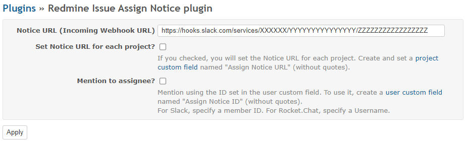
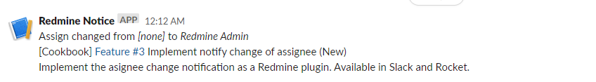
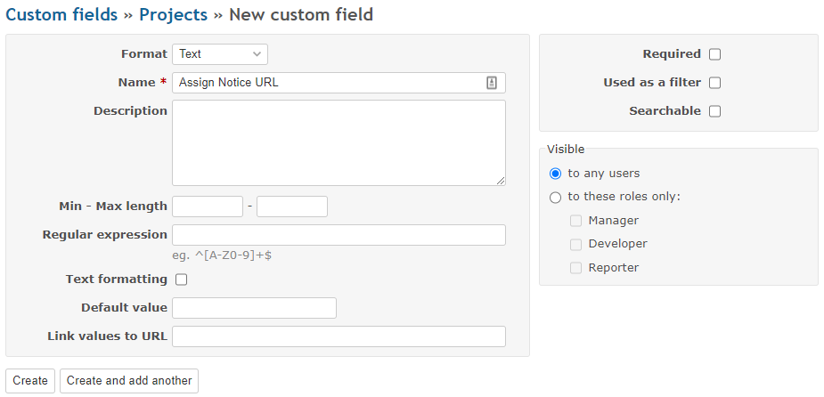
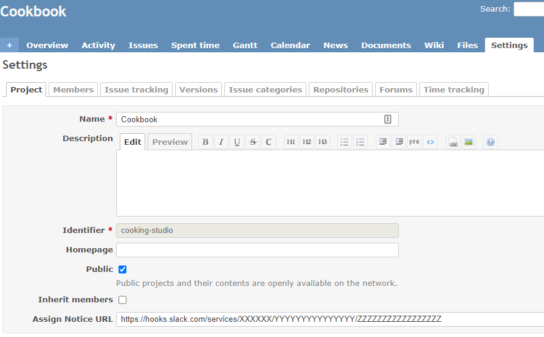
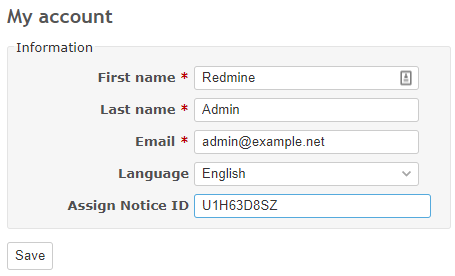

# Redmine issue assign notice plugin

チケットの担当者に変更があったことを、SlackやRocket.Chat、Teams、Google Chat、Mattermost などに通知する[Redmine](http://www.redmine.org)のプラグインです。

## インストール方法

Redmineのプラグインディレクトリに、本リポジトリをクローンします。  
その後、`bundle install`で依存するライブラリをインストールします。

```
cd {RAILS_ROOT}/plugins
git clone https://github.com/onozaty/redmine_issue_assign_notice.git
bundle install --without development test
```

## 利用方法

プラグインの設定画面から、通知に関する設定を行います。



「Notice URL」には、通知先(Slack、Rocket.Chat等)で発行したIncoming WebhookのURLを入力します。

チケットの担当者が変更されたとき、Notice URLで設定したWebhookが実行され、下記のようなメッセージが投稿されるようになります。



メッセージの内容は下記の通りです。

* 1行目: 担当者変更に関する情報
* 2行目: プロジェクト名、トラッカー、チケット番号、題名、ステータス
* 3行目: チケット新規作成時は説明、チケット変更時は注記(先頭200文字まで)

### Set Notice URL for each project?

「Set Notice URL for each project?」をチェックすると、プロジェクト毎にNotice URLを設定できます。  
プロジェクト毎のNotice URLは、プロジェクトのカスタムフィールドの「Assign Notice URL」が利用されます。カスタムフィールドを作成して、各プロジェクトで設定を行うようにしてください。





### Mention to assignee? (Except when you assign yourself)

「Mention to assignee? (Except when you assign yourself)」をチェックすると、担当者となったユーザに対してのメンションをメッセージに含めることができます。ただし、担当者自身で設定したものは通知しません。


メンション先のIDは、ユーザのカスタムフィールドの「Assign Notice ID」が利用されます。カスタムフィールドを作成して、各ユーザで設定を行うようにしてください。




入力するIDは、通知先によって異なります。

* Slack: メンバーID
* Rocket.Chat: ユーザ名
* Teams: UPN (メールアドレス)
* Google Chat: ユーザID
* Mattermost: ユーザ名

### Disable sending description and notes?

「Disable sending description and notes?」をチェックすると、説明および注記をメッセージに含みません。

## サポートバージョン

Redmine 3.0.x から 3.4.x, 4.0.x 以降

## ライセンス

MIT License

## 作者

[onozaty](https://github.com/onozaty)

## 謝辞

このプラグインは、下記のプラグインの実装を参考に作成しました。このようなすばらしいプラグインを公開してくれた作者に感謝します。

* [sciyoshi/redmine\-slack: Slack notification plugin for Redmine](https://github.com/sciyoshi/redmine-slack)

本プラグインのコードの一部は、上記プロジェクトに帰属します。
